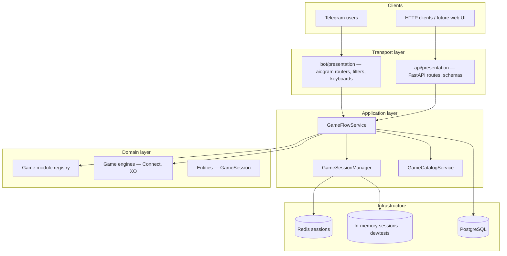
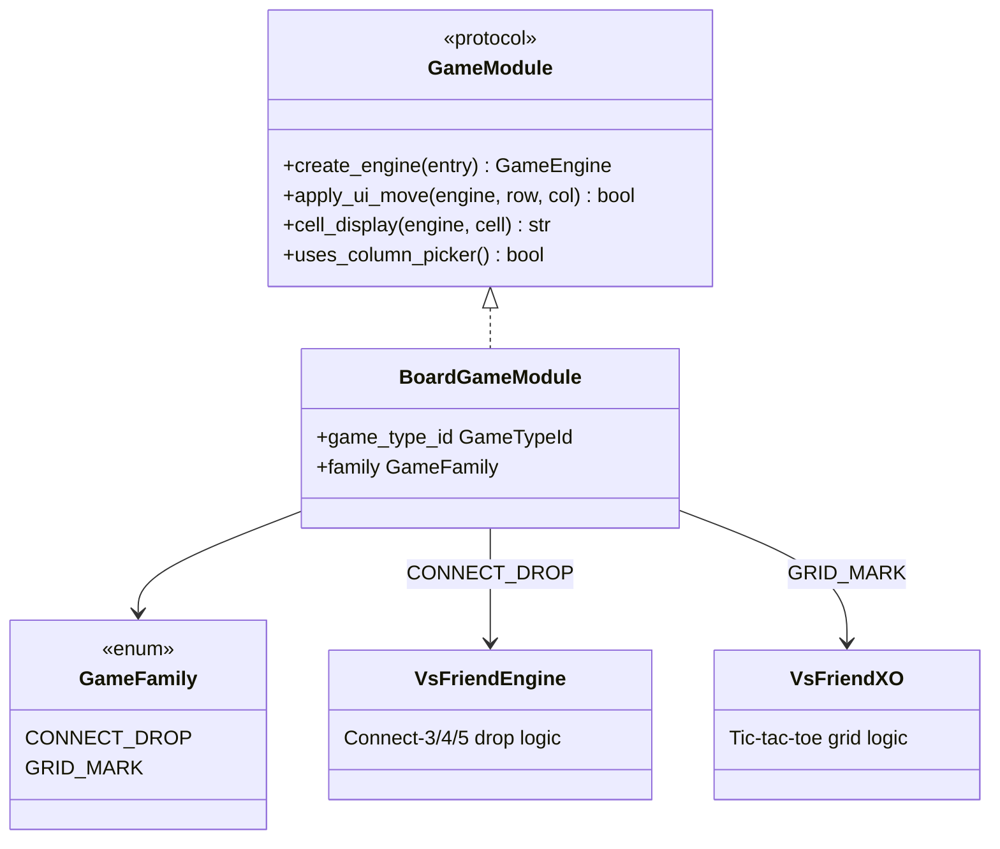
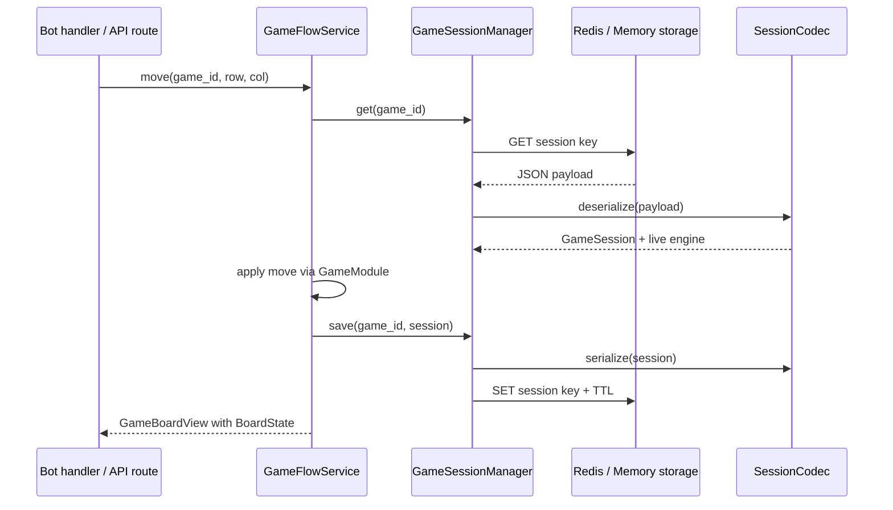
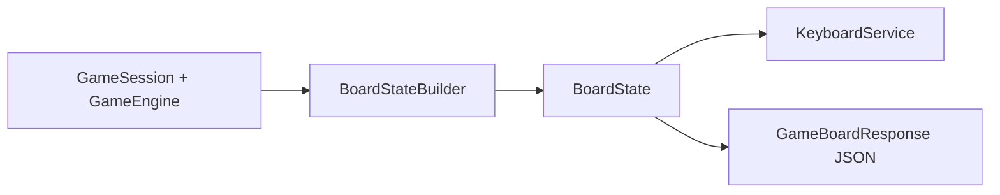
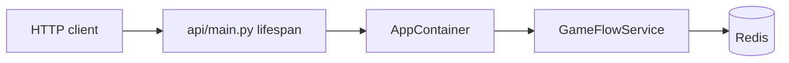
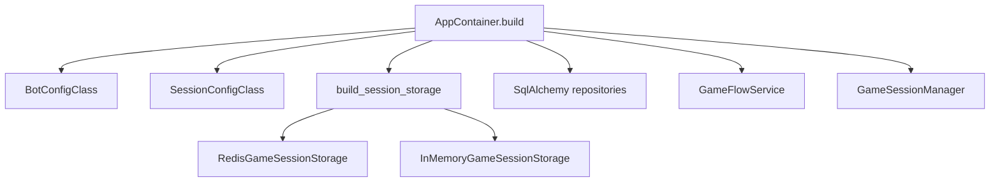
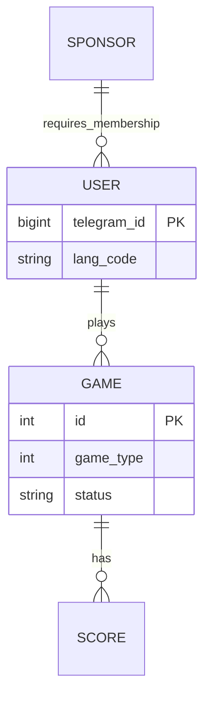
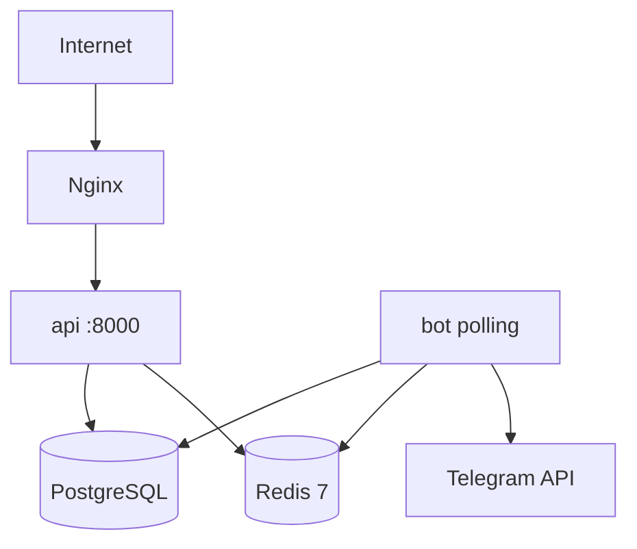
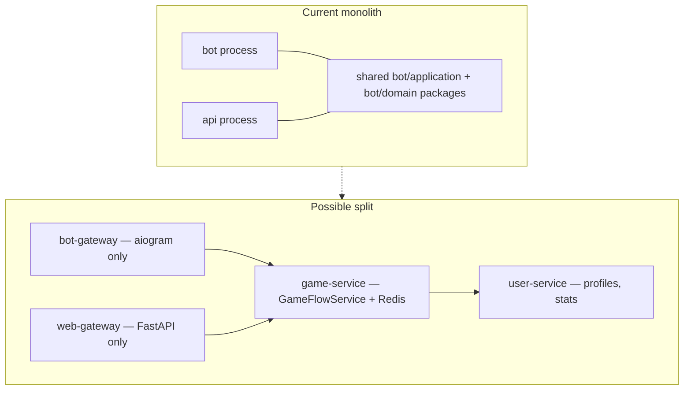

# Kio Games — Architecture

This document describes the multi-game platform architecture after the refactor from a single Connect-4 Django bot to a **Clean Architecture** stack shared by the Telegram bot and REST API.

## Goals

- **Multi-game platform** — Connect-3/4/5 and XO today; new games via plugin registry
- **Shared domain logic** — Bot handlers and REST API call the same `GameFlowService`
- **Horizontal scaling** — Redis-backed sessions so multiple bot/API instances can share state
- **Presentation-agnostic board** — `BoardState` DTO decouples Telegram keyboards from game engines
- **Future microservices** — Clear boundaries between transport, application, domain, and persistence

---

## High-level overview

Both entry points resolve dependencies through `AppContainer` (`bot/core/container.py`).

---

## Layer responsibilities

| Layer | Package | Responsibility |
|-------|---------|----------------|
| **Presentation** | `bot/presentation/`, `api/presentation/` | HTTP/Telegram I/O, request validation, response mapping |
| **Application** | `bot/application/` | Use cases (`GameFlowService`), DTOs (`BoardState`, `GameBoardView`), orchestration |
| **Domain** | `bot/domain/` | Game rules, entities, repository ports, plugin registry |
| **Infrastructure** | `bot/infrastructure/`, `api/infrastructure/` | Redis, SQLAlchemy repos, Telegram adapters |
| **Core / DI** | `bot/core/` | `AppContainer`, `BotApplication` wiring |

Dependency rule: **inner layers never import outer layers**. Handlers depend on services; services depend on ports and domain types.

---

## Game plugin registry

Each game type is registered in `bot/domain/games/registry.py` as a `BoardGameModule`:

### Adding a new game

1. Implement a `GameEngine` subclass under `bot/domain/games/<name>/`
2. Add a `GameTypeId` and catalog entry in `GameCatalogService`
3. Register a `BoardGameModule` (or new family) in `GAME_MODULES`
4. Add i18n keys and inline query article if exposed in Telegram

No changes to `GameFlowService` move/join logic are required when the new game fits an existing `GameFamily`.

---

## Session storage and serialization

Active games live in **Redis** (production) or **in-memory** (tests/local). PostgreSQL stores persistent records (users, finished games, scores).

### StoredGameSession

The wire format (`bot/domain/schemas/session_store.py`) contains:

- Player list, current player, game type, language
- `EngineSnapshot` — engine-specific board state (not the live Python object)

On read, `from_stored_session()` rebuilds the engine via `restore_engine()`.

| Setting | Env var | Default |
|---------|---------|---------|
| Backend | `SESSION_BACKEND` | `redis` |
| Redis URL | `REDIS_URL` | `redis://redis:6379/0` |
| Key prefix | `REDIS_SESSION_PREFIX` | `kio:session:` |
| Timeout | `GAME_SESSION_TIMEOUT` | `300` s |

When a session expires, `GameSessionManager` emits `session_deleted`; the bot edits the inline message to show a timeout keyboard.

---

## BoardState DTO

Telegram keyboards and API responses no longer touch live engine objects. `BoardStateBuilder` converts a `GameSession` into a frozen Pydantic model:

`BoardState` fields:

- `rows` — grid of `BoardCell` (row, col, display label)
- `column_picker` — optional column buttons (Connect games only)
- `players` — `PlayerSlot` list with current-turn flag
- `game_over`, `game_type`, `game_id`

This keeps presentation stable when engine internals change.

---

## REST API (`/games`)

FastAPI exposes the same use cases as the bot:

| Method | Path | Use case |
|--------|------|----------|
| `POST` | `/games` | Create game |
| `GET` | `/games/{id}` | Current board state |
| `POST` | `/games/{id}/join` | Second player joins |
| `POST` | `/games/{id}/move` | Apply move |

The API lifespan creates `AppContainer`, attaches it to `app.state.container`, and closes Redis on shutdown.

Admin routes (`/admin/*`) remain separate and use SQLAlchemy session injection for CRUD.

---

## Dependency injection

`AppContainer.build()` is the single composition root:

Optional parameters for tests:

- `session_backend="memory"`
- `init_db=False`
- `user_repo` / `game_repo` fakes

---

## i18n

Translations live in `bot/locales/{tr,en,fa}/`. `bot/i18n_bootstrap.py` registers locales at import time. Middleware resolves user language from DB or Telegram `language_code`.

`GameFlowService` uses `Translator` for all user-visible strings; API error responses return `message_key` for client-side lookup if needed.

---

## Data persistence

SQLAlchemy models and repositories live under `api/infrastructure/persistence/`. Migration scripts in `tools/` import legacy data from `kio-bot.sql`.

---

## Deployment topology

Docker Compose services: `db`, `redis`, `api`, `bot`, `nginx`.

Deploy script: `scripts/deploy.sh pacman`.

---

## Roadmap: microservices

The current monorepo already separates concerns for future extraction:

Suggested extraction order:

1. **Game service** — Move `GameFlowService`, session storage, and `/games` routes behind an internal HTTP/gRPC API
2. **User service** — Profiles, language, sponsor checks
3. **Bot gateway** — Thin aiogram layer calling game/user services

`BoardState` and `StoredGameSession` are already JSON-serializable contracts suitable for cross-service calls.

---

## Key files

| Concern | Path |
|---------|------|
| Game flow | `bot/application/services/game_flow.py` |
| Board DTO | `bot/application/dto/board.py`, `board_state.py` |
| Session manager | `bot/application/services/session_manager.py` |
| Redis storage | `bot/infrastructure/session/redis_storage.py` |
| Game registry | `bot/domain/games/registry.py` |
| REST routes | `api/presentation/routes/games.py` |
| DI container | `bot/core/container.py` |
| Bot entry | `bot/main.py` |
| API entry | `api/main.py` |

---

## Testing strategy

| Test file | Covers |
|-----------|--------|
| `tests/test_game_flow.py` | Create / join / move use cases |
| `tests/test_game_registry.py` | Plugin registry and engine creation |
| `tests/test_session_serialization.py` | Round-trip `StoredGameSession` |
| `tests/test_board_state.py` | `BoardStateBuilder` for Connect vs XO |
| `tests/test_game_api.py` | FastAPI `/games` integration |

Run: `poetry run pytest`
